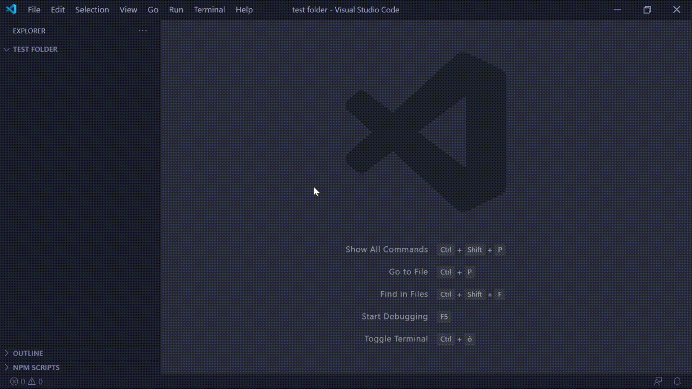

# React Create Component

## The problem ❌
The boilerplate to create a React component is often the same and can be automated.

## The solution 🎉
Right-click on the folder that you want your component to be placed in, select 'Create React Component', type its name and it's done!

## State of art 🎡
For now the extension is very minimalistic, it will create a **Stateless Javascript functional component** with a CSS file for the stylesheet and a folder with a basic setup for its unit tests (@testing-library).

## Installation
You can [download](https://github.com/mattveraldi/vscode-create-react-component/releases/tag/1.0.0/) the .vsix file and [install it manually.](https://code.visualstudio.com/docs/editor/extension-gallery#_install-from-a-vsix) (soon it will also be avaiable on Visual Studio Marketplace)

## Next steps
Please, see [CONTRIBUTING.md](CONTRIBUTING.md)
