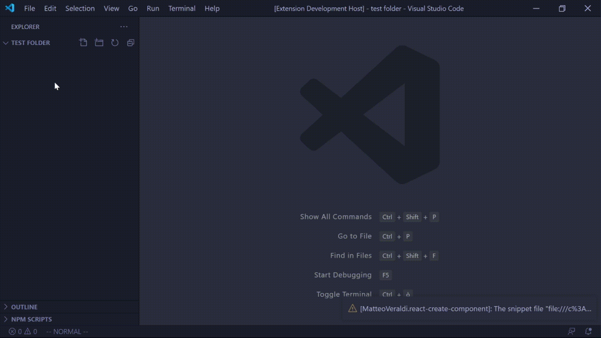

# React Create Component

## The problem :x:
The boilerplate to create a React component is often the same and can be automated.

## The solution :tada:
Right-click on the folder that you want your component to be placed in, select 'Create React Component', type its name and it's done!

## State of art :dart:
For now the extension is very minimalistic, it will create a **Stateless Javascript functional component** with a CSS file for the stylesheet and a folder with a basic setup for its unit tests (@testing-library).

## Next steps
Please, see CONTRIBUTING.md.